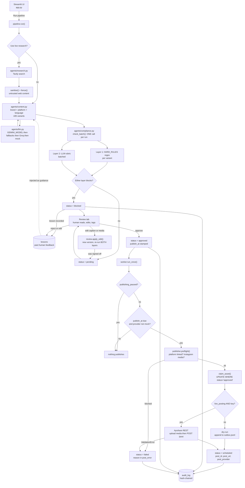
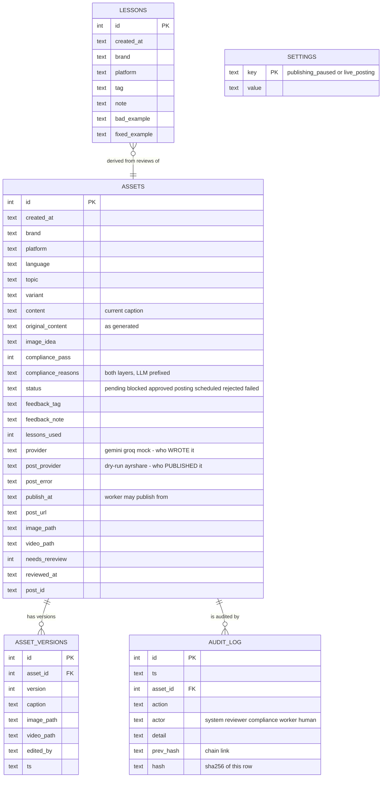
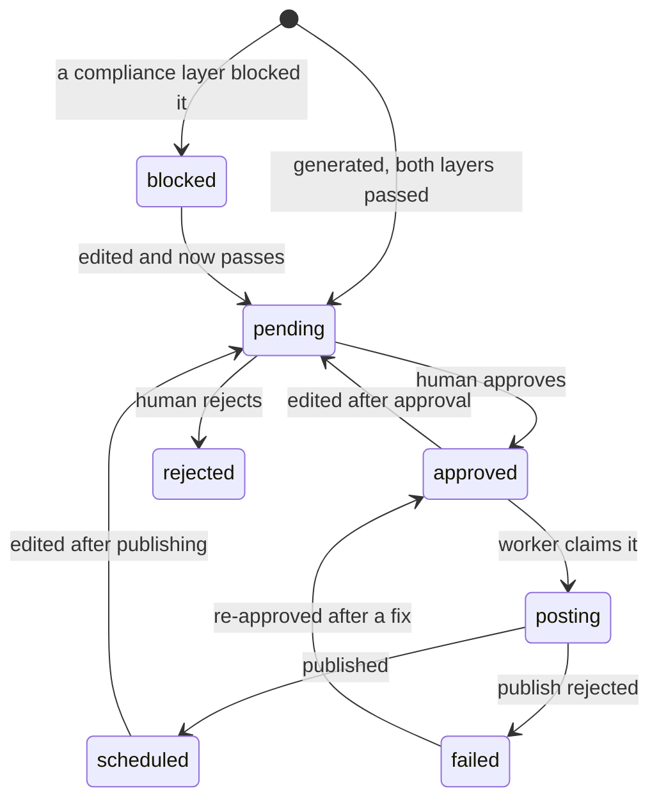

# Architecture

## End-to-end flow

The dotted line is the feedback loop: every rejection, edit or compliance block
becomes a row in `lessons`, which `agents/content.py` injects into the next
generation for that brand.

## Database

`SETTINGS` has no foreign keys — it holds the two global publishing switches so
every session and every worker process reads the same state.

## Status lifecycle

An edit to anything a human already signed off (`approved`, `posting`,
`scheduled`, `failed`) returns it to `pending` and raises `needs_rereview`.

## Two independent publishing gates

Both default to the safe position and are stored in `settings`, not in memory,
so a second worker process or a second browser session cannot disagree:

| Gate | Default | Effect |
|---|---|---|
| `publishing_paused` | off | When on, **nothing** publishes — dry-run included |
| `live_posting` | **off** | Real posting needs this **and** `AYRSHARE_API_KEY` |

With a key present but `live_posting` off, the publisher is `dry-run` and makes
zero API calls.
